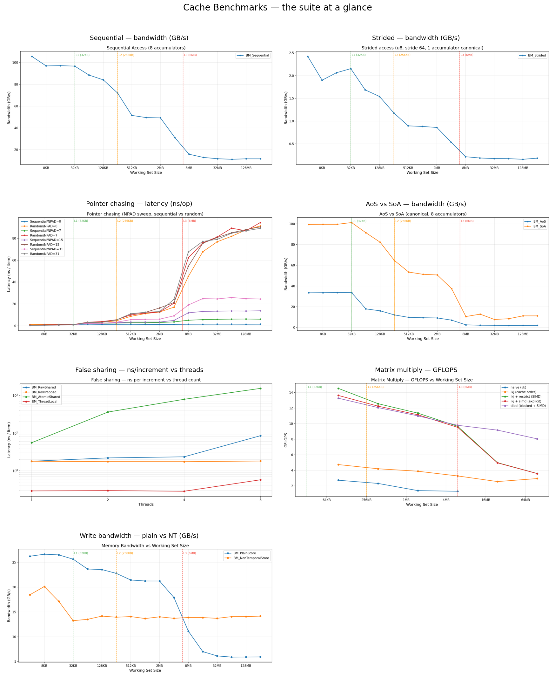
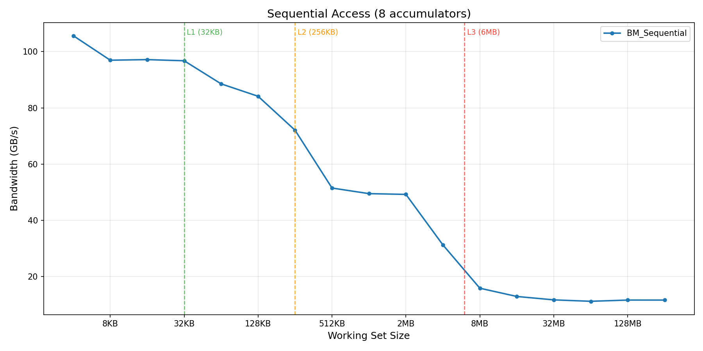
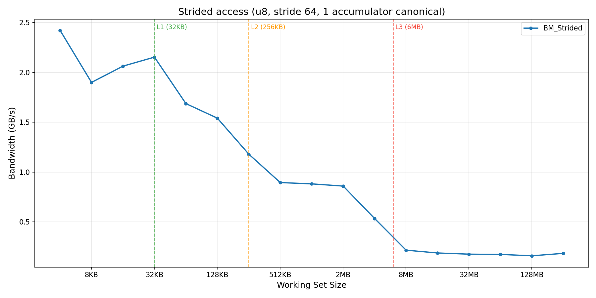
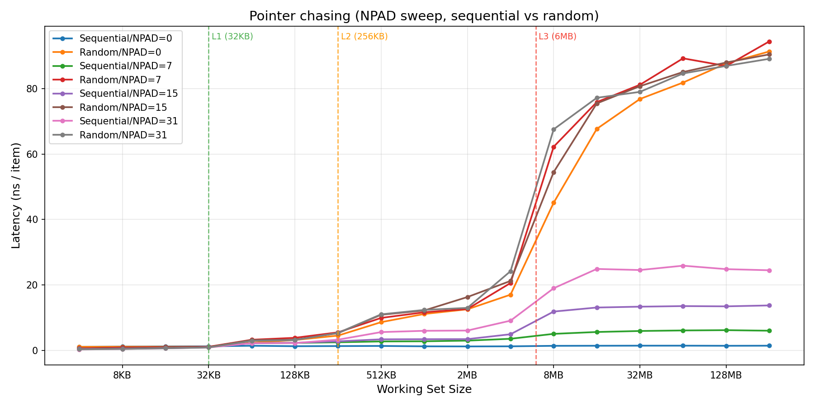
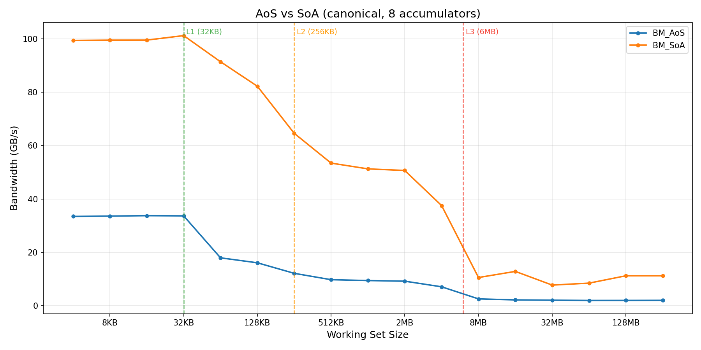
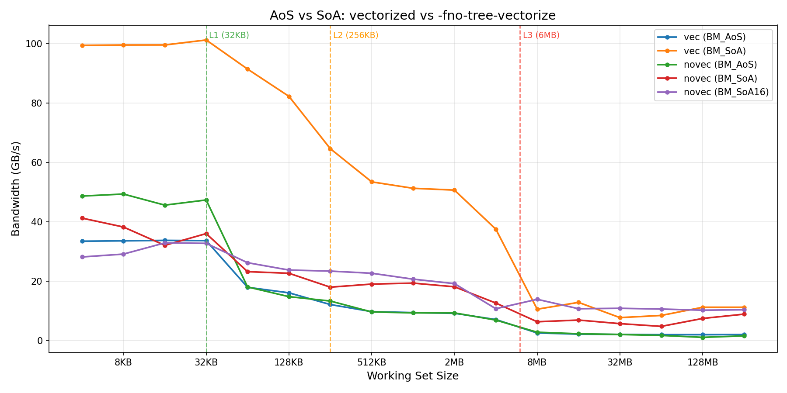
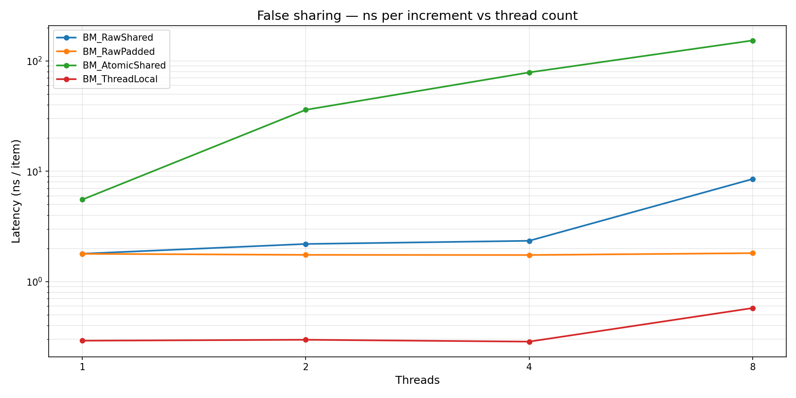
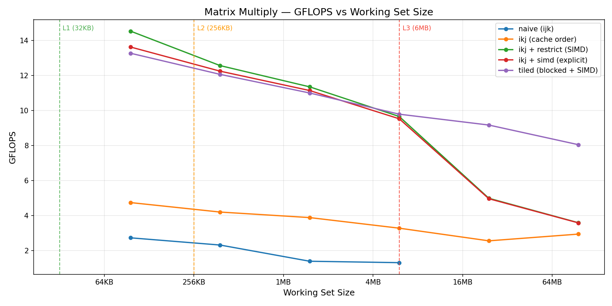
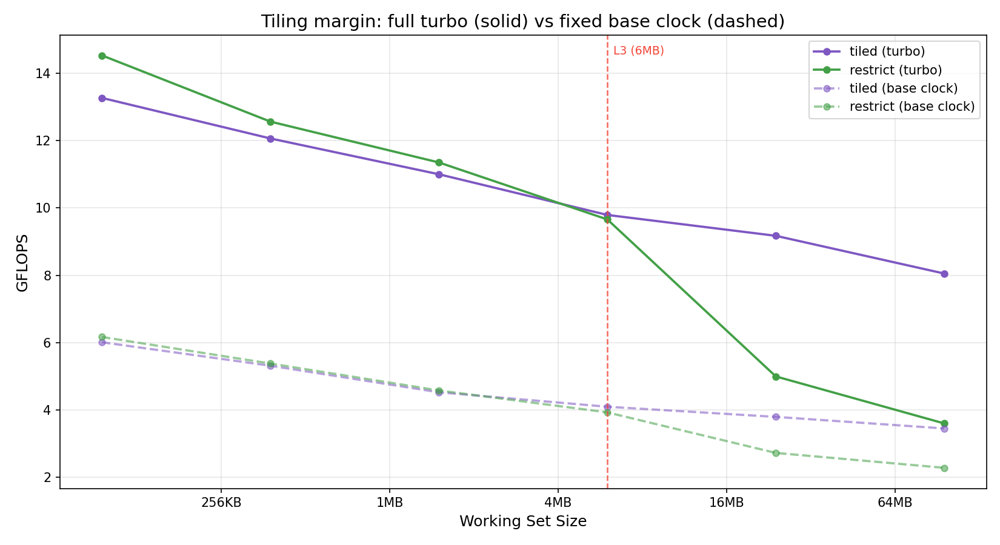
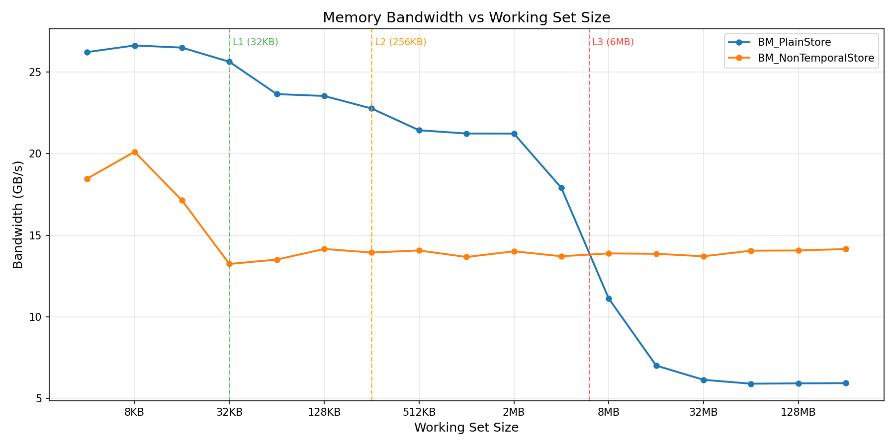

# Cache Benchmarks

Microbenchmarks that measure CPU cache behavior by sweeping working set sizes
from 4 KB to 256 MB. The measured bandwidth and latency staircases reveal
L1d, L2, L3, and RAM boundaries, following the experiments described in
Ulrich Drepper's *What Every Programmer Should Know About Memory*.

**Reading this report**: start here for the overview and hardware context,
then follow the "Deep dive" links into each benchmark's notes under
[`notes/`](notes/) for the investigation writeups and assembly-level analysis.

## Test Hardware

| Component | Specification |
| ----------- | -------------- |
| CPU | Intel Core i7-8550U (Kaby Lake R), 4 cores / 8 threads, 1.8 GHz base / 4.0 GHz boost |
| L1d | 32 KB per core, 8-way set-associative |
| L2 | 256 KB per core, 4-way |
| L3 | 6 MB shared across all cores, 12-way |
| RAM | DDR4-2400, single channel (one 8 GB DIMM) |
| OS | Fedora 42, kernel 6.19.9 |
| Compiler | GCC with `-O2 -march=native` (enables AVX2 auto-vectorization) |
| Benchmark | Google Benchmark 1.9.4 |

All runs use `-O2 -march=native`, the CPU governor set to `performance`, ASLR
disabled (`setarch -R`), and the process pinned to a single physical core
(`taskset -c 3`; `false_sharing` uses `-c 0-7` for its thread sweep). Every
result JSON records `aslr_enabled: false` and `cpu_scaling_enabled: false`.
[`scripts/run_benchmarks.sh`](scripts/run_benchmarks.sh) reproduces these
conditions per benchmark, building any missing binary first.

## Summary — the suite at a glance

Each benchmark reports a different metric (GB/s, ns/op, GFLOPS), so this is a
small-multiples grid rather than one shared-axis chart — every panel keeps its
own units.



| Benchmark | Metric | Headline finding |
|-----------|--------|------------------|
| Sequential | GB/s | ~104 (L1) → ~13 (RAM); 8 accumulators break the serial dependency chain |
| Strided | GB/s | ~64× below sequential — only 1 of 8 bytes per cache line is used |
| Pointer chasing | ns/op | random ~90 ns flat (the DRAM wall); the prefetcher gives up to 65× on sequential |
| AoS vs SoA | GB/s | SoA 3–5.6× AoS — AoS wastes 5/6 of every fetched line |
| False sharing | ns/incr | AtomicShared ~45× RawPadded at 4 threads |
| Matrix multiply | GFLOPS | tiled ~2.2× restrict past L3 — blocking breaks the memory wall |
| Write bandwidth | GB/s | NT store ~2.4× plain past L3 — plain stores pay a hidden RFO read |

## Benchmarks

### Sequential Access

Scans a `uint64_t` array sequentially, measuring bandwidth (GB/s). Uses 8
independent accumulators to break serial dependency chains and expose memory
bandwidth.



| Region | Working Set | Bandwidth |
| -------- | ------------- | ----------- |
| L1d | 4 - 32 KB | ~104-114 GB/s |
| L2 | 64 - 256 KB | ~77-95 GB/s |
| L3 | 512 KB - 4 MB | ~34-55 GB/s |
| RAM | 8 - 256 MB | ~12-17 GB/s |

**Deep dive**: [notes/sequential.md](notes/sequential.md) — accumulator sweep
(1/4/8/16 accumulators), compute-bound ceiling discovery, serial dependency
chain analysis.

### Strided Access

Reads one byte per cache line (stride 64), forcing a full 64-byte fetch for
every 1-byte read. Reported bandwidth reflects only bytes actually read,
making the cost of wasted spatial locality directly visible.



| Region | Working Set | Bandwidth |
| -------- | ------------- | ----------- |
| L1d | 4 - 32 KB | ~1.9-2.4 GB/s |
| L2 | 64 - 256 KB | ~1.2-1.7 GB/s |
| L3 | 512 KB - 4 MB | ~0.5-0.9 GB/s |
| RAM | 8 - 256 MB | ~0.16-0.22 GB/s |

The bandwidth drop compared to sequential is close to the theoretical 64× —
the ratio between the cache line size and data actually used per line.

**Deep dive**: [notes/strided.md](notes/strided.md) — 5-variant comparison
(u8/u64, stride 64/128/4096, 1 vs 8 accumulators), spatial prefetcher quirks,
why stride 128 is slower than stride 64.

### Pointer Chasing

Builds a circular linked list and traverses it by following pointers,
measuring latency (ns per dereference). Each load depends on the previous
one — the CPU cannot overlap or prefetch ahead (in random mode).



| NPAD | Sequential (256 MB) | Random (256 MB) | Prefetcher speedup |
| ------ | --------------------- | ----------------- | ------------------- |
| 0 (8 B) | ~1.4 ns | ~91 ns | 65× |
| 7 (64 B) | ~6.0 ns | ~94 ns | 16× |
| 15 (128 B) | ~13.7 ns | ~91 ns | 6.6× |
| 31 (256 B) | ~24.5 ns | ~89 ns | 3.6× |

Random access converges to ~90 ns regardless of node size — that's the true
DRAM round-trip latency.

**Deep dive**: [notes/pointer_chasing.md](notes/pointer_chasing.md) — NPAD
sub-investigation, 90 ns RAM latency insight, prefetcher effectiveness vs
node size.

### AoS vs SoA

Compares Array-of-Structures (48-byte struct, only `x` field read) vs
Structure-of-Arrays (contiguous `uint64_t` array). AoS wastes 5/6 of every
cache line fetched; SoA uses every byte.



| Region | AoS | SoA | Sequential (8 acc) | AoS/SoA ratio |
|--------|-----|-----|---------------------|---------------|
| L1d (32 KB) | 33.7 | 101.2 | ~107 | 3.0× |
| L2 (128 KB) | 16.1 | 82.2  | —    | 5.1× |
| L3 (1 MB)   | 9.4  | 51.3  | —    | 5.5× |
| RAM (256 MB)| 2.0  | 11.2  | —    | 5.6× |

SoA overlaps sequential almost perfectly — both are contiguous uint64 reads.
The L1d AoS number (~34 GB/s) is largely a port-5 saturation effect from
GCC's gather vectorization of stride-48 loads. Disabling vectorization lifts
AoS to ~48 GB/s. A SoA variant with 16 accumulators (`BM_SoA16`) hits
~154 GB/s at L1d — the "compute ceiling" reference for this chip on this
code shape.



**Deep dive**: [notes/aos_vs_soa.md](notes/aos_vs_soa.md) — four-variant
investigation (double→uint64, sizing bug, novec counter-experiment), full
assembly analysis, `perf stat` port-utilization validation. The longest and
most instructive writeup — read this one on a big screen.

### False Sharing

N threads each increment their own counter. Four variants change *where the
counters live*: packed into one cache line (plain and atomic), or each on its
own 64-byte line, plus a register-only baseline. First multi-threaded
benchmark in the suite — the story is MESI, the store buffer, and
memory-ordering machine clears.



| Threads | ThreadLocal | RawPadded | RawShared | AtomicShared |
|---------|-------------|-----------|-----------|--------------|
| 1       | 0.29 ns     | 1.79 ns   | 1.79 ns   | 5.54 ns      |
| 2       | 0.30 ns     | 1.75 ns   | 2.19 ns   | 36.0 ns      |
| 4       | 0.29 ns     | 1.74 ns   | 2.34 ns   | 78.6 ns      |
| 8       | 0.58 ns     | 1.81 ns   | 8.50 ns   | 153 ns       |

At 4 threads AtomicShared is **~45× slower** than RawPadded. The smaller
RawShared/RawPadded gap (only ~1.3×) is the surprise: on x86 TSO, store-buffer
batching hides most inter-core line transfers. `perf stat` showed
`machine_clears.memory_ordering` at **41M/s** vs `xsnp_hitm` (actual line
transfers) at only 217K/s — speculation flushes from cross-core snoops are
the real cost of plain-write false sharing.

**Deep dive**: [notes/false_sharing.md](notes/false_sharing.md) — four-variant
assembly comparison, `perf stat` MESI vs memory-ordering decomposition, why
the textbook "MESI ping-pong" cost only fully materializes under `lock`-prefixed
atomics.

### Matrix Multiply

Computes `C = A * B` for square `double` matrices, measuring GFLOPS. Five
variants add one optimization at a time — naive `ijk`, cache-friendly `ikj`
reorder, `__restrict` (auto-SIMD), explicit `std::experimental::simd`, and
cache-blocked `tiled` — isolating three independent axes: memory access pattern,
vectorization, and reuse.



| N (working set) | ikj | restrict | simd | tiled |
| ----------------- | ----- | ---------- | ------ | ------- |
| 512 (6 MB) | 3.3 | 9.7 | 9.5 | 9.8 |
| 1024 (24 MB) | 2.6 | 5.0 | 5.0 | 9.2 |
| 2048 (96 MB) | 3.0 | 3.6 | 3.6 | 8.1 |

Vectorization sets the ceiling — the three SIMD variants start ~3× above the
scalar ones and overlap while the data is cache-resident. Tiling defends that
ceiling past the cache cliff: at the L3 boundary (6 MB, N=512) restrict and simd
fall away as they re-stream the B-matrix from RAM for every row, while tiled reuses each
cache-resident block and holds ~8-9 GFLOPS — **~2.2× at N=2048**. The margin is
wider at full turbo than at a fixed base clock: a faster CPU outruns RAM harder,
so it is more memory-bound, so reuse matters more.



**Deep dive**: [notes/matrix_multiply.md](notes/matrix_multiply.md) — five-variant
progression (ijk → ikj → restrict → explicit SIMD → tiled), the `RAM traffic ∝
1/T` reuse model, the tile-size sweep (why L1-blocking is the *worst* fitting
choice), and a measurement-methodology section on getting stable numbers.

### Write Bandwidth

Streams stores across an array, measuring write bandwidth (GB/s) — the suite's
only write-bound benchmark. Two variants: a plain store (`a[i] = c`) and a
non-temporal store (`_mm_stream_si64`). x86 caches are write-allocate, so a plain
store to an uncached line pays a Read-For-Ownership — it reads the 64-byte line
from RAM just to overwrite it; NT stores bypass the cache and skip that read.



| Region | Plain (GB/s) | NT (GB/s) | NT / Plain |
|--------|--------------|-----------|------------|
| L1d (4-32 KB)    | ~26    | ~18 | 0.7× |
| L2 (64-256 KB)   | ~23    | ~14 | 0.6× |
| L3 (512 KB-4 MB) | ~18-21 | ~14 | 0.7× |
| RAM (8-256 MB)   | ~5.9   | ~14 | ~2.4× |

Plain store wins wherever the data fits cache (write hits, no RFO) and falls off
a cliff past L3 as every line becomes an RFO read-plus-write. NT store is a flat
~14 GB/s — it never touches the cache — so it loses in-cache but wins **~2.4×**
once the data spills to RAM by skipping the RFO read. The crossover sits at L3.

**Deep dive**: [notes/write_bandwidth.md](notes/write_bandwidth.md) — the RFO
mechanism (why a write is secretly a read), `movnti`/write-combining, and the
crossover-at-L3 analysis.

## Repository layout

```
cache_benchmarks/
├── src/                         # Benchmark source files
│   ├── sequential_access.cpp
│   ├── strided_access.cpp
│   ├── pointer_chasing.cpp
│   ├── aos_vs_soa.cpp
│   ├── false_sharing.cpp
│   ├── matrix_multiply.cpp
│   └── write_bandwidth.cpp
├── include/                     # Shared headers
├── notes/                       # Deep-dive writeups (the good stuff)
│   ├── sequential.md
│   ├── strided.md
│   ├── pointer_chasing.md
│   ├── aos_vs_soa.md
│   ├── false_sharing.md
│   ├── matrix_multiply.md
│   ├── write_bandwidth.md
│   └── hardware_background.md
├── results/                     # Benchmark output (JSON + plots)
│   ├── sequential/              # 1/4/8/16 accumulator variants
│   ├── strided/                 # u8/u64, stride 64/128/4096 variants
│   ├── pointer_chasing/         # NPAD 0/7/15/31, sequential/random
│   ├── aos_vs_soa/              # V3 buggy, V4 canonical, novec
│   ├── false_sharing/           # 4 variants × {1,2,4,8} threads
│   ├── matrix_multiply/         # 5 variants, turbo + base-clock runs
│   └── write_bandwidth/         # plain vs non-temporal store
├── perf/                        # `perf stat` dumps for the false-sharing MESI analysis
├── scripts/                     # run_benchmarks.sh + plot generation (plot_results.py, ...)
├── CMakeLists.txt
└── README.md                    # ← you are here
```

## Hardware reference

See [notes/hardware_background.md](notes/hardware_background.md) for:
Skylake/Kaby Lake port layout, cache latencies, prefetcher types, and a
reading list (Agner Fog, uops.info, Drepper, Intel manuals, Travis Downs).
