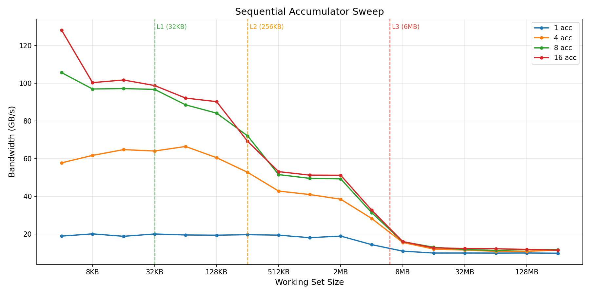

# Sequential Access — Notes

## What the benchmark does

Scans a `std::vector<uint64_t>` sequentially and sums every element,
measuring read bandwidth in GB/s as the working set grows from 4 KB to 256 MB.
Sequential access is the "best case" for memory: the hardware prefetcher
detects the stream and keeps the memory bus saturated ahead of the program,
so bandwidth is as high as the hardware can deliver at each cache level.

All runs use `-O2 -march=native` and are pinned to a single core with
`taskset -c 3`.

## Canonical result

The canonical version uses **8 independent accumulators** inside the inner
loop (the number of accumulators matters — see the [accumulator
experiment](#the-accumulator-experiment) below for why 8 was chosen).


| Region | Working set | Bandwidth (8 acc) | Notes |
|--------|-------------|-------------------|-------|
| L1d | 4-32 KB | ~104-114 GB/s | Auto-vectorized into 2× `vpaddq ymm`; Benchmark-framework limited |
| L2  | 64-256 KB | ~77-95 GB/s | Slight drop as L2 latency starts mattering |
| L3  | 512 KB - 4 MB | ~34-55 GB/s | L3 latency dominates |
| RAM | 8-256 MB | ~12-17 GB/s | DRAM saturation, prefetcher keeps the bus busy |

The plot is the classic memory hierarchy staircase. Each flat region
corresponds to a cache level — bandwidth is roughly constant while the
working set fits, then drops sharply once the data spills into the next
level. The four steps (L1d → L2 → L3 → RAM) are clearly visible, with
roughly 8× total bandwidth difference between the fastest (L1d, ~104 GB/s)
and slowest (RAM, ~13 GB/s) regions.

GCC auto-vectorizes the 8 scalar accumulators into two `vpaddq ymm`
instructions (AVX2), processing 64 bytes — one full cache line — per
iteration. This loop has two theoretical throughput ceilings:

- **Load-port ceiling.** Skylake/Kaby Lake has 2 load ports (p2, p3), each
  capable of one 32-byte load per cycle. At ~3.7 GHz:
  `2 loads × 32 B × 3.7 GHz ≈ 237 GB/s`.
- **Retirement ceiling.** An out-of-order CPU executes instructions
  speculatively, but must *retire* them — commit results in original program
  order — through the back end of the pipeline (see Agner Fog's
  microarchitecture manual, Skylake pipeline section). Skylake retires at
  most 4 fused µops per cycle.
  The loop body is 5 fused µops (2 `vmovdqu` loads, 2 `vpaddq` adds, 1
  fused compare+branch for the loop counter), so it takes at least
  ⌈5/4⌉ = 1.25 cycles per iteration to retire. At 3.7 GHz:
  `64 B / 1.25 cycles × 3.7 GHz ≈ 188 GB/s`.

The retirement ceiling (188 GB/s) is lower than the load-port ceiling
(237 GB/s), so retirement width is the tighter bound for this loop. In
other words, even though the load ports could deliver data faster, the CPU
cannot commit the results fast enough to keep up.

The measured ~104 GB/s is about 55% of even the retirement ceiling. The
shortfall comes from Google Benchmark's outer machinery at small working
sets plus the CPU not sustaining peak boost under sustained AVX2 load (see
`aos_vs_soa.md` for the detailed investigation of this gap).

A 16-accumulator variant produces nearly identical numbers at 8-32 KB
(~106-109 GB/s), confirming that the 8-acc loop is already close to the
memory bandwidth ceiling at L1d. The two variants converge at L2 and below,
where memory — not compute — is the bottleneck. See the [accumulator
experiment](#the-accumulator-experiment) for the full comparison.

## The accumulator experiment

I expected a simple `sum += data[i]` loop would be enough to measure memory
bandwidth. It is not. A single accumulator creates a **serial dependency
chain** — each `add` must wait for the previous `add` to complete before it
can run. Integer add on Kaby Lake has 1-cycle latency, so the throughput
ceiling of a 1-accumulator loop is:

```
1 add per cycle × 8 bytes per add × 4 GHz ≈ 32 GB/s
```

In practice I measure ~20 GB/s (below the theoretical ceiling because of
loop overhead and load-port contention). That is **well below** L1d's real
memory bandwidth, so a naive benchmark would hit the compute ceiling at every
cache level and report a flat curve that tells you nothing about memory.

To break the dependency chain, I use multiple independent accumulators so
the CPU can issue several adds in flight at once. More accumulators → more
independent work per cycle → higher sustained throughput, until you hit the
real memory ceiling.

I ran four variants to see the effect.

### Results — accumulator sweep

All numbers in **GB/s**. Single `uint64_t` array, straight sequential read.
These are the JSON values from the canonical result files in `results/sequential/`.

| Size | Region | 1 acc | 4 acc | **8 acc** | 16 acc |
|------|--------|-------|-------|-----------|--------|
| 4 KB   | L1d | 18.9 | 57.8 | **113.5** | 137.7 |
| 8 KB   | L1d | 20.1 | 61.7 | **104.1** | 107.7 |
| 16 KB  | L1d | 18.8 | 64.8 | **104.3** | 109.2 |
| 32 KB  | L1d | 20.0 | 64.0 | **103.9** | 106.1 |
| 64 KB  | L2  | 19.5 | 66.4 | **95.1**  | 98.9  |
| 128 KB | L2  | 19.4 | 60.5 | **90.3**  | 96.9  |
| 256 KB | L2  | 19.6 | 52.7 | **77.4**  | 74.3  |
| 512 KB | L3  | 19.4 | 42.8 | **55.3**  | 57.0  |
| 1 MB   | L3  | 18.0 | 40.9 | **53.2**  | 55.0  |
| 2 MB   | L3  | 18.9 | 38.5 | **52.9**  | 54.9  |
| 4 MB   | L3  | 14.3 | 28.2 | **33.6**  | 35.1  |
| 8 MB   | RAM | 10.9 | 15.5 | **17.1**  | 17.2  |
| 32 MB  | RAM |  9.9 | 11.5 | **12.6**  | 13.2  |
| 256 MB | RAM |  9.8 | 11.4 | **12.6**  | 12.3  |

The 8-acc and 16-acc columns are from a back-to-back run on the same idle
box. The 1-acc and 4-acc columns are from an earlier session but are stable
(compute-bound loops are insensitive to thermal variation).



### What the numbers mean

**1 accumulator** — a flat line at ~20-21 GB/s from L1d through L3. This is
the fingerprint of a compute-bound loop: bandwidth does *not* depend on
working set size. The CPU is waiting on the serial add chain, not on memory.
The curve finally bends at 4 MB because at that point even the slow compute
ceiling is faster than memory can deliver, and memory takes over as the true
bottleneck. In the RAM region, the curve converges at ~10-11 GB/s.

**4 accumulators** — jumps to ~60-70 GB/s at L1d (about 3× faster than 1).
Still flat through L1d/L2 though, meaning even 4 independent adds don't fully
saturate the load ports. GCC folds 4 scalars into one `vpaddq ymm` — a
single 32-byte load + add per iteration:

```asm
.L:  mov    rdx, rax
     inc    rax
     shl    rdx, 0x5
     vpaddq ymm0, ymm0, [rbx+rdx]    ; 32 bytes of data
     cmp    rax, rcx
     jb     .L
```

6 fused µops, 1 data load, processing 32 bytes per iteration. The single
accumulator `ymm0` creates a 1-cycle dependency chain — each `vpaddq` waits
for the previous one — so throughput is 1 add per cycle = 32 B/cycle ≈ 118
GB/s at 3.7 GHz. The measured ~65 GB/s is below that because of the 4 µops
of loop overhead per iteration.

**8 accumulators** (canonical) — reaches ~104-114 GB/s at L1d. GCC folds 8
scalars into two `vpaddq ymm` — two 32-byte loads per iteration, 64 bytes
(one cache line):

```asm
.L:  inc    rdx
     vpaddq ymm1, ymm1, [rax]        ; 32 bytes
     vpaddq ymm0, ymm0, [rax+0x20]   ; 32 bytes
     add    rax, 0x40
     cmp    rdx, rcx
     jb     .L
```

5 fused µops, 2 data loads, 2 independent accumulators (`ymm0`, `ymm1`).
With no dependency between the two `vpaddq` instructions, both can issue in
the same cycle. The curve staircases cleanly through the hierarchy:
L1d (~104) → L2 (~90) → L3 (~53) → RAM (~13).

**16 accumulators** — roughly equivalent to 8 accumulators across most of
the hierarchy (within 2-7%), with one exception: the 4 KB point, where 16
acc hits ~138 GB/s vs 8 acc's ~114 GB/s (+21%). That single outlier is the
Benchmark framework overhead effect — at 4 KB there are very few inner loop
iterations, so the fixed per-measurement cost (timer, counter) is a larger
fraction of total time, and the larger loop body (512 vs 64 bytes) amortizes
it better. At 8-32 KB and above, the difference disappears.

The generated code is more complex than expected. Rather than a clean 4×
`vpaddq ymm` loop, GCC's SLP vectorizer loads 15 data blocks per iteration,
then uses 128 shuffle instructions (`vpermq` + `vpunpcklqdq`/
`vpunpckhqdq`) to redistribute elements across the accumulator lanes before
doing the 16 `vpaddq` operations:

```
16-acc inner loop breakdown (178 instructions per iteration, 512 bytes of data):
  vpaddq:              16   (the actual adds)
  vmovdqu [rax+...]:   15   (data loads from the array)
  vpermq:              64   (lane permutations)
  vpunpck*:            64   (element interleave/deinterleave)
  vmovdqa [rsp+...]:   16   (accumulator spills to stack)
  vmovdqa ...[rsp+..]: 16   (accumulator reloads from stack)
```

Despite this massive shuffle overhead, performance matches 8 accumulators
because the shuffles execute on ports 1 and 5, which don't compete with the
data loads on ports 2 and 3. The 16 stack spill/reload pairs are cheap at
L1d (they hit in cache). At L2 and below, both variants converge because
memory — not compute — is the bottleneck.

### Beyond 16: register pressure collapse

To find the true ceiling, I also ran 32 and 64 accumulators:

| Accumulators | L1d (32 KB) | L2 (128 KB) | RAM (256 MB) |
|---|---|---|---|
| 8 | 104 GB/s | 90 GB/s | 13 GB/s |
| 16 | 106 GB/s | 97 GB/s | 12 GB/s |
| **32** | **9.3 GB/s** | **9.3 GB/s** | **5.0 GB/s** |
| 64 | 47 GB/s | 29 GB/s | 10 GB/s |

**32 accumulators is catastrophically bad** — 9.3 GB/s flat across all cache
levels, worse than even 1 accumulator (~20 GB/s). The assembly tells the
story: GCC generates a 465-instruction inner loop with the same
shuffle-heavy strategy as 16 accumulators, but now with far more register
pressure:

```
32-acc inner loop breakdown (465 instructions per iteration, 1024 bytes of data):
  vpaddq:               32   (the actual adds)
  vmovdqu [r*+...]:     32   (data loads from the array)
  vpermq:              160   (lane permutations)
  vpunpck*:            160   (element interleave/deinterleave)
  vmovdqa [rsp+...]:    78   (accumulator spills to stack)
  vmovdqa ...[rsp+..]:  68   (accumulator reloads from stack)
```

The 78 stack stores + 68 stack loads per iteration are the killer. Each
spill is a load or store to L1d that competes with the 32 data loads on the
same cache ports. The data loads are now a minority of the loop's total
memory traffic — the loop is dominated by spill housekeeping, not useful
work.

**64 accumulators partially recovers** to ~47 GB/s at L1d. The source uses
an array (`s[64]`) instead of named scalars, and GCC switches to a
completely different strategy — a tight 6-instruction loop that streams
through the accumulator array:

```asm
.L:  vmovdqu ymm0, [rcx+rax]          ; load 32 bytes from data array
     add     rax, 0x20
     vpaddq  ymm0, ymm0, [rax+rdx-0x20] ; add 32 bytes from accumulator array
     vmovdqa [rax+rdx-0x20], ymm0      ; store back to accumulator array
     cmp     rax, 0x200
     jne     .L
```

This is a load-add-store loop over the 512-byte accumulator array (64 ×
8 bytes), repeated for each 512-byte chunk of the data array. No shuffles,
no spills — but every iteration does 2 loads + 1 store instead of just 2
loads. The extra store to the accumulator array halves the effective load
bandwidth, which is why it tops out at ~47 GB/s — roughly half of what the
clean 8-accumulator loop achieves.

**16 is the practical ceiling for this microarchitecture.** Going to 32
causes GCC's shuffle+spill overhead to overwhelm the useful work. Going to
64 avoids the spills via a different code generation strategy, but pays the
cost of streaming through an accumulator array in memory.

### Why 8 stays canonical

The canonical choice stays at **8** because (a) 8 and 16 produce nearly
identical bandwidth across the entire hierarchy (within 2-7%), (b) 8
generates a clean 5-instruction loop vs 16's 178-instruction shuffle-heavy
monster, and (c) the "one cache line per iteration" mental model makes the
code easy to reason about. There is no performance reason to prefer 16.
`BM_SoA16` in `aos_vs_soa.md` revisits the same trade-off for SoA.

### The key observation

**The 1-accumulator curve is a compute-bound fingerprint.** If you ever see a
bandwidth benchmark that produces a flat line across L1d, L2, and L3, you are
measuring something inside the CPU (serial dependency, execution-unit
latency, front-end issue rate) rather than something in the memory hierarchy.
The fix is always to increase parallelism until the memory hierarchy becomes
the narrower pipe than whatever CPU-side resource was limiting throughput.

This lesson generalized directly to the AoS vs SoA benchmark, where the
first attempt made exactly this mistake with a single accumulator and
reported a flat ~7 GB/s line across every cache level. Same failure mode,
different cause (FP latency instead of integer latency).

## References

- **Source**: [`src/sequential_access.cpp`](../src/sequential_access.cpp)
- **Canonical result**: [`results/sequential/8acc_canonical.json`](../results/sequential/8acc_canonical.json)
- **Accumulator sweep**: [`results/sequential/1acc.json`](../results/sequential/1acc.json),
  [`4acc.json`](../results/sequential/4acc.json),
  [`16acc.json`](../results/sequential/16acc.json),
  [`32acc.json`](../results/sequential/32acc.json),
  [`64acc.json`](../results/sequential/64acc.json)
- **Plot**: [`results/sequential/canonical.png`](../results/sequential/canonical.png),
  [`accumulator_sweep.png`](../results/sequential/accumulator_sweep.png)
- **Related**: the same "compute ceiling hides memory" trap shows up in
  [`aos_vs_soa.md`](aos_vs_soa.md) Variant 1, with FP latency instead of integer.
