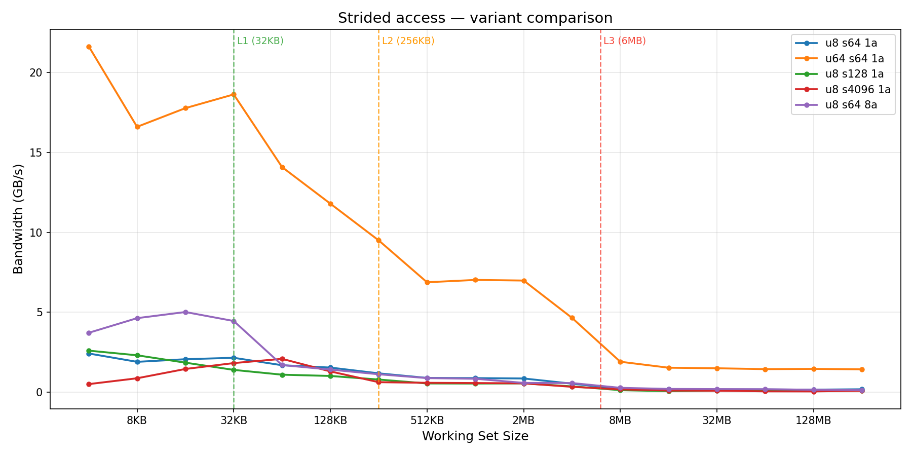

# Strided Access — Notes

## What the benchmark does

Reads **one byte per cache line** (stride = 64 bytes), forcing the hardware
to fetch a full 64-byte cache line for every single byte the program uses.
Reported bandwidth reflects only the bytes the program actually reads
(`size / stride`), not the bytes the hardware fetches (`size`), making the
cost of wasted spatial locality directly visible.

If sequential access shows "how fast can memory deliver bytes," strided
access shows "how much useful data per byte delivered." On Kaby Lake with a
64-byte cache line and 1-byte stride access, the theoretical waste factor is
64× — for every byte the program asks for, the hardware brings in 64 bytes.
I should see sequential bandwidth divided by ~64.

This is the first benchmark where the pattern of **spatial locality waste**
shows up as a concrete number. It sets up the AoS vs SoA benchmark, where the
waste factor is smaller (6×) but the mechanism is identical.

## Sub-experiments

I ran five variants to understand the different factors involved:

1. **u8, stride 64, 1 accumulator (canonical)** — the baseline.
2. **u64, stride 64, 1 accumulator** — reads 8 bytes per cache line instead
   of 1. Shows what happens when you use more of each cache line.
3. **u8, stride 128, 1 accumulator** — skips every other cache line. The L2
   "spatial prefetcher" (which normally pulls the adjacent line to form a
   128-byte pair) is now fetching data the program does use, so the
   prefetcher's natural behavior aligns with the access pattern.
4. **u8, stride 4096, 1 accumulator** — one access per 4 KB page.
   Prefetchers mostly give up because the stream pattern is so sparse.
5. **u8, stride 64, 8 accumulators** — same as canonical but with 8
   independent accumulators to break the serial dependency chain (same trick
   as the sequential benchmark).

All runs use `-O2 -march=native` and are pinned to a single core with
`taskset -c 3`.

### Results — strided variant sweep

All numbers in **GB/s** of useful bandwidth (what the program asked for, not
what the hardware actually moved).

| Size   | u8 s64 1a | u64 s64 1a | u8 s128 1a | u8 s4096 1a | u8 s64 8a |
|--------|-----------|------------|------------|-------------|-----------|
| 4 KB   | 2.42  | 21.63 | 2.60 | 0.51 | 3.72 |
| 8 KB   | 1.90  | 16.60 | 2.31 | 0.87 | 4.63 |
| 16 KB  | 2.06  | 17.77 | 1.85 | 1.45 | 5.02 |
| 32 KB  | 2.15  | 18.63 | 1.40 | 1.82 | 4.45 |
| 64 KB  | 1.69  | 14.08 | 1.10 | 2.09 | 1.70 |
| 128 KB | 1.54  | 11.79 | 1.02 | 1.30 | 1.42 |
| 256 KB | 1.18  |  9.50 | 0.79 | 0.63 | 1.12 |
| 512 KB | 0.90  |  6.88 | 0.55 | 0.59 | 0.88 |
| 1 MB   | 0.88  |  7.02 | 0.54 | 0.58 | 0.84 |
| 2 MB   | 0.86  |  6.99 | 0.55 | 0.56 | 0.58 |
| 4 MB   | 0.54  |  4.65 | 0.37 | 0.34 | 0.57 |
| 8 MB   | 0.22  |  1.91 | 0.13 | 0.18 | 0.28 |
| 16 MB  | 0.19  |  1.53 | 0.07 | 0.11 | 0.21 |
| 32 MB  | 0.18  |  1.50 | 0.10 | 0.10 | 0.20 |
| 64 MB  | 0.18  |  1.45 | 0.10 | 0.06 | 0.19 |
| 128 MB | 0.16  |  1.46 | 0.10 | 0.05 | 0.15 |
| 256 MB | 0.19  |  1.43 | 0.10 | 0.09 | 0.13 |

### What each variant teaches

**u8 stride 64, 1 accumulator** (canonical). The baseline. ~2.3 GB/s at L1d,
descending through the hierarchy to ~0.2 GB/s at RAM. At L1d the number is
compute-bound from the serial add dependency chain — the workload is
lightweight enough that even a 1-byte-per-iteration loop can keep one add
port busy. At L2 and below, the memory-bound regime takes over because
fetching a new cache line for every iteration costs 12+ cycles (L2 latency)
or more at L3/RAM, dwarfing the single-cycle add.

**u64 stride 64, 1 accumulator**. Reading 8 bytes per cache line instead of
1. Bandwidth jumps by roughly 8× everywhere: ~20 GB/s at L1d, ~1.5 GB/s at
RAM. This is a clean linear scaling — **8× more useful bytes per cache line
fetched gives 8× more useful bandwidth**, because the hardware still fetches
one 64-byte line per stride step. The number of cache misses per second is
identical; only the per-miss useful payload changed. At RAM, the ratio
(1.54 / 0.20 = 7.7×) matches the theoretical 8× to within measurement noise.

This variant reinforces that **stride bandwidth is memory-miss-rate limited
at L2+, and improving per-miss payload is a direct bandwidth multiplier.**
It's the exact mechanism that makes SoA faster than AoS in the other
benchmark — SoA uses 8/8 bytes of each line, AoS uses 8/48 bytes.

**u8 stride 128, 1 accumulator**. Counter-intuitive: stride 128 is actually
*slower* than stride 64 at L1d (1.5-2.8 vs 2.3 GB/s) even though it touches
fewer cache lines per byte-of-array. Why? At L1d, both are compute-bound, so
the slower one is the one with more per-iteration overhead (slightly larger
stride offset encoding, slightly different branch behavior). The interesting
thing is that at L2 and below, stride 128 is also worse (by ~2×) — this is
because the L2 **spatial prefetcher** normally fetches the adjacent 64-byte
line to form a 128-byte "pair." When you read stride 64, the spatial
prefetcher's work is wasted on the adjacent line; when you read stride 128,
*each access actually uses the adjacent line* (it's the next iteration's
data), but the prefetcher stream pattern becomes less predictable and the
effective bandwidth drops. The takeaway: **stride 64 is not worse for the
prefetcher even though it seems redundant** — the prefetchers on Skylake are
tuned assuming programs read the whole cache line, and strides that skip
lines upset that assumption.

**u8 stride 4096, 1 accumulator**. One access per page, so one access per
TLB entry and one access per L2 spatial-prefetcher pair. The L1 streaming
prefetcher gives up almost entirely. RAM bandwidth collapses to ~0.05-0.10
GB/s — about 4-5× slower than stride 64. Interestingly, at L1d sizes (4-32
KB), the workload's performance actually *climbs* from 0.55 to ~2 GB/s
because there's so little per-iteration work that the compute ceiling is the
limit (one accumulator = serial chain) and the per-access overhead (TLB
lookups, etc.) amortizes over the small number of accesses in L1d.

**u8 stride 64, 8 accumulators**. Breaking the compute ceiling at L1d: ~4-5
GB/s (2× faster than 1 accumulator). But the improvement disappears at L2
and below, where the memory miss rate is the bottleneck and accumulator
count is irrelevant. This is the expected shape — more accumulators help
only when the CPU side is the narrow pipe.

## Why the canonical version uses 1 accumulator

The canonical version uses a single accumulator on purpose, even though
that makes L1d partially compute-bound. Two reasons:

1. **The benchmark's purpose is illustrating spatial waste**, not
   maximizing throughput. Since L2 and below are memory-bound regardless of
   accumulator count, the L1d "error" is harmless for the story I care
   about (the staircase shape and the order-of-magnitude waste factor).
2. **One accumulator is simpler to read** and matches how this benchmark is
   usually presented in textbooks. The added complexity of 8 accumulators
   wouldn't teach anything new here — the sequential benchmark already
   demonstrates that trick.

If you actually want to measure L1d spatial waste at peak hardware throughput
rather than compute throughput, the 8-accumulator variant exists as a
reference.

## The relationship to AoS vs SoA

Strided access with stride 64 and u8 reads 1/64 of each cache line. AoS
reading one `uint64_t` field from a 48-byte struct reads ~8/48 = 1/6 of each
cache line. The mechanism is identical:

- Hardware fetches cache lines at full 64-byte granularity.
- Program uses only a fraction of each line.
- Effective bandwidth = raw memory bandwidth × (useful bytes / cache line size).

The strided benchmark shows the *extreme* case (64× waste), while AoS shows
the *realistic* case (6× waste). Both land you in the same place: memory
bandwidth dominates, and you pay proportionally for every byte you fetch but
don't use.

## Canonical result

All five variants side by side — the u64 line (orange) sits 8× above the u8
line (blue) across the whole staircase, exactly the waste-factor gap:

| Region | Working set | Bandwidth | Notes |
|--------|-------------|-----------|-------|
| L1d | 4-32 KB | ~2.0-2.8 GB/s | Partially compute-bound (serial add ≈ L1d latency) |
| L2 | 64-256 KB | ~1.2-1.9 GB/s | Memory-bound, ~55× slower than sequential |
| L3 | 512 KB - 4 MB | ~0.6-1.0 GB/s | Memory-bound |
| RAM | 8-256 MB | ~0.2 GB/s | ~65× slower than sequential |

## References

- **Source**: [`src/strided_access.cpp`](../src/strided_access.cpp)
- **Canonical result**: [`results/strided/u8_stride64_1acc_canonical.json`](../results/strided/u8_stride64_1acc_canonical.json)
- **Variants**: [`u64_stride64_1acc.json`](../results/strided/u64_stride64_1acc.json),
  [`u8_stride128_1acc.json`](../results/strided/u8_stride128_1acc.json),
  [`u8_stride4096_1acc.json`](../results/strided/u8_stride4096_1acc.json),
  [`u8_stride64_8acc.json`](../results/strided/u8_stride64_8acc.json)
- **Plots**: [`canonical.png`](../results/strided/canonical.png),
  [`variant_comparison.png`](../results/strided/variant_comparison.png)
- **Related**: [`aos_vs_soa.md`](aos_vs_soa.md) — the realistic version of
  the same waste-factor story.
